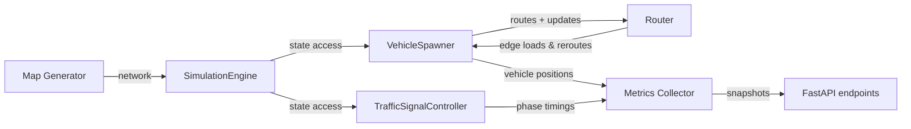

# TrafficFlow

TrafficFlow is a discrete-time traffic simulation sandbox featuring congestion-aware routing, signal timing, and lightweight vehicle dynamics. It powers both standalone experiments and the accompanying FastAPI backend for visualizing network state.

## Setup

1. Install Python 3.11 and create a virtual environment:

   ```bash
   python -m venv .venv
   source .venv/bin/activate
   ```

2. Install runtime and development dependencies:

   ```bash
   pip install -r requirements.txt -r requirements-dev.txt
   ```

3. Install the pre-commit hooks to keep formatting, linting, and types aligned:

   ```bash
   pre-commit install
   ```

## Running the simulation backend

The FastAPI app exposes the live simulation state plus a simple frontend:

```bash
uvicorn src.server.runtime:create_app --factory --reload
```

You can also run the engine directly for headless experiments:

```python
from src.simulation.core import SimulationEngine, load_config
from src.agents.vehicle import VehicleSpawner
from src.signals.lights import TrafficSignalController

config = load_config("config.yml")
engine = SimulationEngine(config)
TrafficSignalController(engine.state["network"]).register(engine)
VehicleSpawner().register(engine)
engine.run(120)
```

## Quality checks and tests

- Format: `black .`
- Lint: `flake8 .`
- Types: `mypy src tests`
- Unit tests: `pytest -m "not integration"`
- Integration tests: `pytest -m integration`

The GitHub Actions workflow (`.github/workflows/ci.yml`) runs all of the above on pushes and pull requests.

## Architecture overview

- **Simulation engine** (`src/simulation/core.py`): tick scheduler with deterministic ordering and pluggable agents.
- **Routing** (`src/pathfinding/router.py`): congestion-aware shortest-path planner with rerouting and load bookkeeping.
- **Signals** (`src/signals/lights.py`): per-intersection traffic lights and a controller agent that advances phases.
- **Vehicles** (`src/agents/vehicle.py`): IDM-inspired car-following model with spawning, queue tracking, and gridlock detection.
- **Map generation** (`src/map/generator.py`): directed grid builder with reproducible seeds and lane-aware capacities.
- **Metrics & API** (`src/metrics/collector.py`, `src/server/runtime.py`): runtime metrics collection, preset management, and REST endpoints.

### Simulation loop

```mermaid
flowchart TD
    S[SimulationEngine.advance_tick] --> Q[Run scheduled agent callbacks]
    Q --> U[Agents mutate shared state (vehicles, signals, closures)]
    U --> R[Reschedule callbacks based on interval]
    R --> T[Increment tick and repeat]
```

### Data flow



## Configuration

Use JSON or YAML to override defaults such as `tick_duration`, `max_ticks`, `seed`, and grid parameters (`rows`, `cols`, `block_length`, `lanes_per_road`, `speed_limit`, `capacity_per_lane`). Load files with `simulation.core.load_config(<path>)` to produce a `SimulationConfig` instance.

## Performance notes

- Vehicles are bucketed by edge and position before each tick to keep iteration cache-friendly.
- Capacity and spawn intervals are conservative by default; presets and API endpoints in `src/server/runtime.py` adjust them for heavier loads.
- The metrics collector reports queue lengths and tick runtimes to spot regressions as fleets scale toward thousands of agents.
